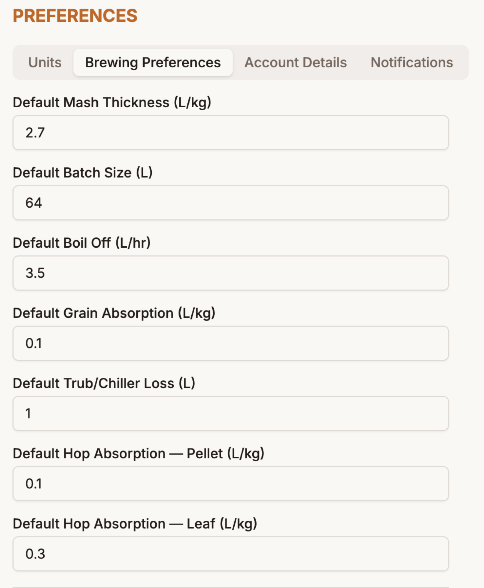
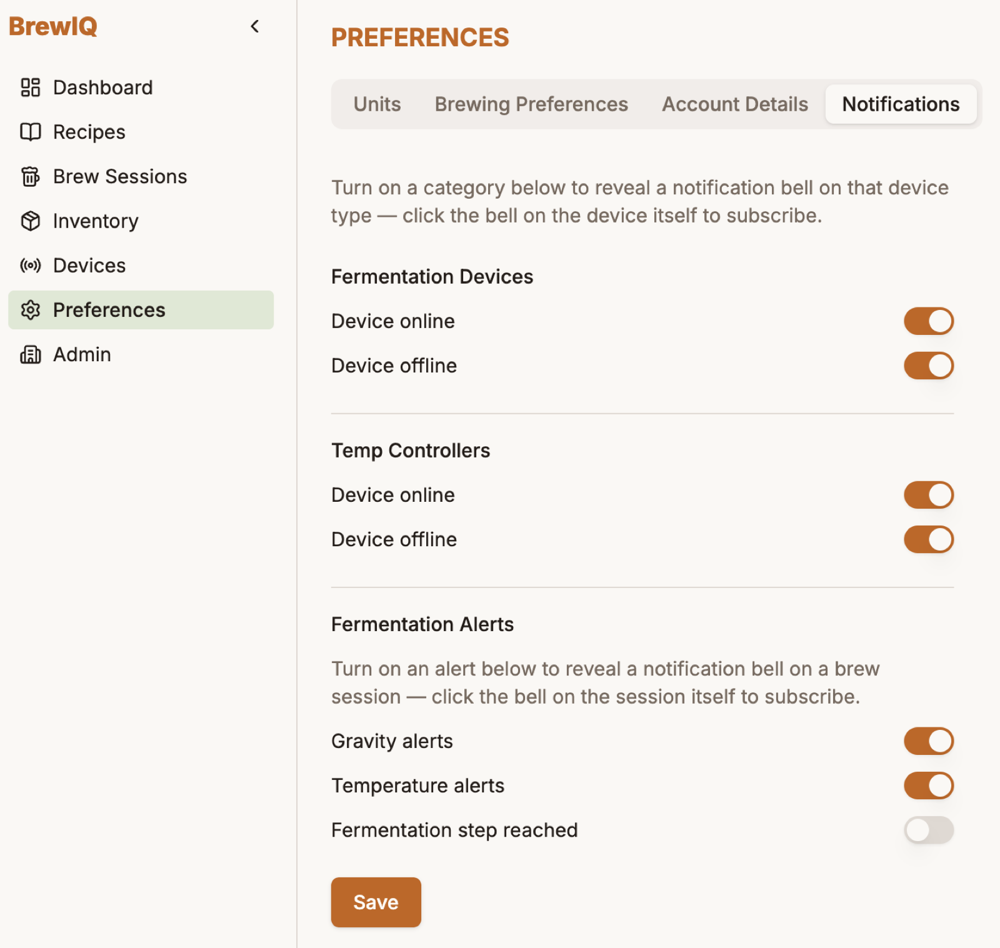

# Account & Preferences

Open **Preferences** from the nav to manage your units, brewing defaults, account details, and notifications, across four tabs.

## Units

- **Unit System** — Metric or Imperial (drives volume/weight display everywhere in the app)
- **Colour Unit** — Lovibond, SRM, or EBC
- **Currency** — NZD, USD, GBP, or EUR
- **Gravity Measurement** — Specific Gravity or Plato

## Brewing Preferences

{ width="380" }

Defaults that pre-fill into new recipes and calculations, in your chosen units:

- Default Mash Thickness
- Default Batch Size
- Default Boil Off (per hour)
- Default Grain Absorption
- Default Trub/Chiller Loss
- Default Hop Absorption — Pellet and Leaf, set separately
- **Fermentation Chart Colours** — pick which colour represents Temp, Gravity, and pH on your fermentation charts

## Account Details

- **Theme** — Light or Dark
- **Profile Picture** — upload a square PNG or JPEG (up to 500KB)
- **Display Name**
- **Email** — changing this requires your current password, and doesn't take effect until you click the confirmation link BrewIQ sends to the new address
- **Change Password** — current password plus a new one, entered twice
- **Multi-factor authentication** — enable, reregister (for a new device), or disable MFA; see [Getting Started](getting-started.md) for the full setup walkthrough

## Notifications

Only visible if your role has notification permissions. Turning on a category here reveals a bell icon in the corresponding place in the app — you still have to click that bell on the specific device or session you want to be alerted about:

- **Fermentation Devices** — device online / device offline
- **Temp Controllers** — device online / device offline
- **Fermentation Alerts** — gravity alerts, temperature alerts, fermentation step reached (bells appear on individual [brew sessions](brew-sessions.md))

## Managing a brewery's team

If you administer your brewery's BrewIQ account — inviting teammates, assigning roles, resetting someone's password or MFA — that's handled from a separate **Admin** area. See [Tenant Administration](tenant-administration.md).
