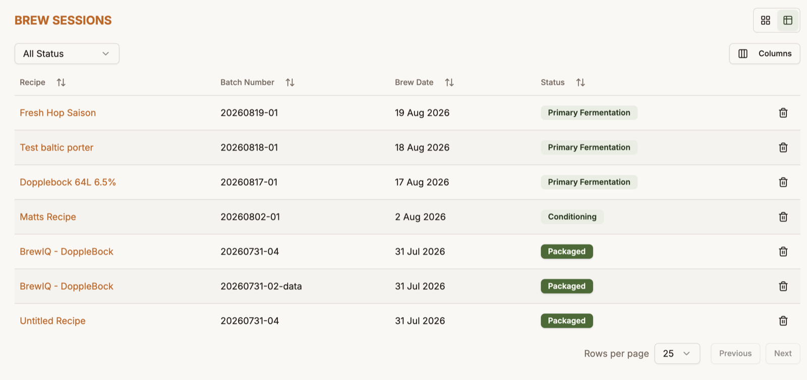
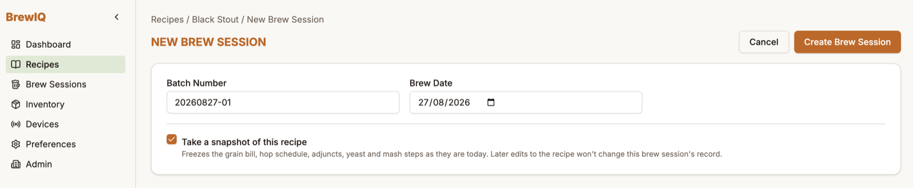
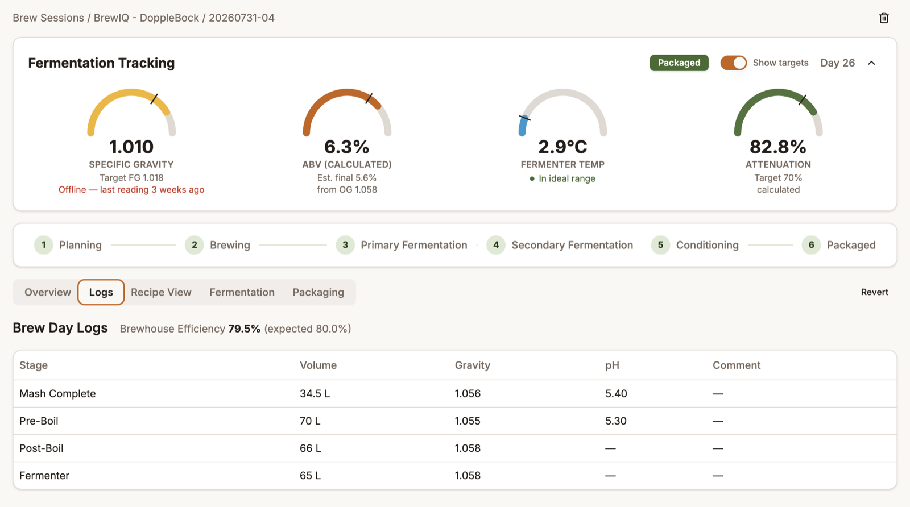
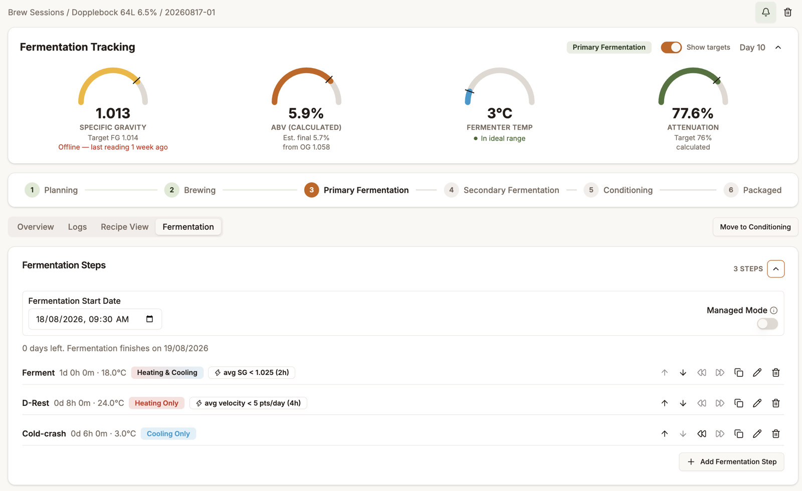
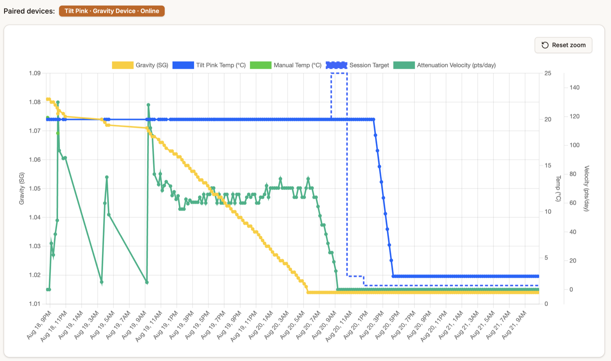
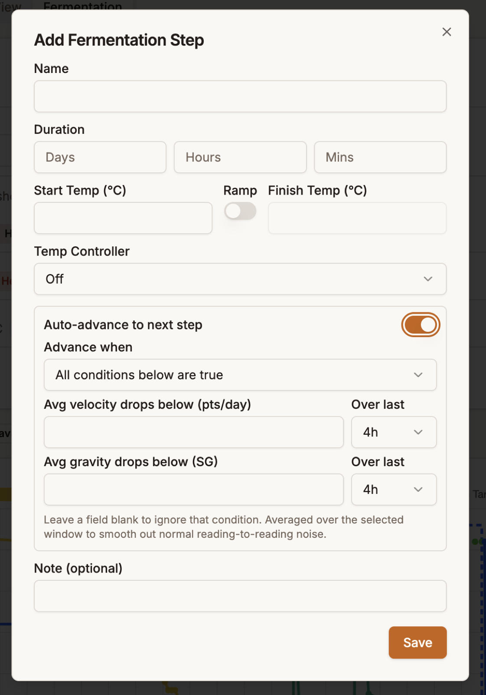
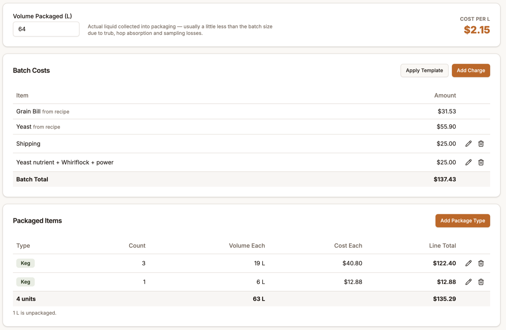

# Brew Sessions

A brew session is a record of one actual batch — brewed from a recipe, tracked through fermentation, and closed out at packaging. There's no "New Brew Session" button on the sessions list itself; every session starts from a recipe's **Brew it!** action (recipe builder, the recipes list, or a recipe's print preview).

## Starting a session

**Brew it!** takes you to a short setup screen — deliberately minimal, no batch scaling or equipment selection here:

- **Batch Number** — auto-suggested based on the brew date, editable
- **Brew Date** — defaults to today
- **Take a snapshot of this recipe** (checked by default) — freezes the grain bill, hop schedule, adjuncts, yeast, and mash steps as they are right now, so later edits to the recipe won't change this session's record

Click **Create Brew Session** to open the session detail page.

Device pairing (a Grainfather controller, a Tilt or similar gravity tracker) isn't part of this setup — you link a device to a session from the [Devices](devices.md) page instead.

## Session status

Every session moves through a fixed sequence: **Planning → Brewing → Primary Fermentation → Secondary Fermentation → Conditioning → Packaged**, shown as a stepper at the top of the session page. Planning and Brewing advance automatically based on the brew date; the fermentation stages advance based on your logs and readings, or manually:

- **Move to Conditioning** — available once you're brewing
- **Mark Packaged** — available once in Conditioning; this also turns off any fermentation-alert email notifications for that session
- **Revert** — undo the last status change (from Packaged back to Conditioning, or from Conditioning back to wherever your logs/readings support)

## Overview tab

Batch Number and Brew Date are editable here (Brew Date locks once fermentation has started). Also shows who created the session and when.

## Logs tab — Brew Day Logs

Records what happened on brew day itself. Each log has a **Log Type** — **Mash Complete, Pre-Boil, Post-Boil, Fermenter** (each loggable once per session), or **Sample** (loggable any number of times) — plus **Wort Volume**, **Wort Gravity**, optional **pH**, and a comment.

Once you've logged a Pre-Boil reading, BrewIQ calculates your actual **Brewhouse Efficiency** for the batch and shows it next to the recipe's expected efficiency, so you can see immediately how the brew day tracked against plan.

Logs lock once the session reaches Conditioning.

## Recipe View tab

A read-only snapshot of the recipe as brewed — grain bill, hop schedule (with the same stage breakdown as the recipe builder), yeast, mash steps, and notes. If you took a snapshot at setup, this reflects the recipe exactly as it was then, even if you've since edited the original recipe.

## Fermentation tab

This is where day-to-day tracking happens, combining manual entries with any linked devices.

**Fermentation Tracking** header — shows four gauges: **Specific Gravity** (with target FG), **ABV (calculated)**, **Fermenter Temp** (flags whether you're in, below, or above the ideal range), and **Attenuation**. If you've linked a gravity-tracking device or temp controller, its data feeds these gauges automatically — whichever source (manual or device) is more recent wins.

**Add Reading** — log Date & Time, Gravity, Temp, pH, and Vessel (Primary/Secondary) by hand at any point.

**Readings table** shows every reading with its source (Manual, or the device it came from). You can select and bulk-delete readings.

**Fermentation chart** — plots gravity, temperature (per source if you have more than one), pH, session target temp, and attenuation velocity over time. Needs at least two readings to appear, and you can drag to zoom.

Everything on this tab locks once the session is Packaged, but stays visible.

### Fermentation Steps — the schedule

This is a step-by-step temperature schedule you build for the batch: name, duration, start temp, and (optionally) a ramp to a finish temp, with an optional Temp Controller mode (Off / Heating & Cooling / Heating Only / Cooling Only) per step.

Turn on **Managed Mode** and BrewIQ pushes each step's target temperature (and heating/cooling mode) to a paired temp controller automatically as the schedule advances — no manual adjustment needed on the controller itself.

Each step can also **auto-advance**: set a condition based on average attenuation velocity dropping below a threshold, average gravity dropping below a threshold, or both, evaluated over a configurable time window, and BrewIQ moves to the next step on its own once the condition is met. You can also **Skip** the active step forward manually, or **Rewind** back to the previous one.

{ width="420" }

Once the session reaches Conditioning, the step list becomes read-only and is replaced by a single flat **Conditioning Temp** field.

## Packaging tab

Available once a session is marked Packaged. This tab tracks **costs and package counts**, not fermentation results — final ABV/attenuation are read from the Fermentation gauges and Overview, not re-entered here.

- **Volume Packaged** — how much liquid you actually collected, with a live cost-per-unit figure calculated alongside it.
- **Batch Costs** — a running list combining ingredient costs pulled in automatically from the recipe plus any manual charges you add (use a negative amount for losses like spillage). You can also **Apply Template** to pull in a saved cost bundle from [Inventory](inventory.md)'s Misc tab.
- **Packaged Items** — log what you packaged it into (Keg / Can / Bottle / Other), with count and volume each; BrewIQ flags if your package totals don't match the Volume Packaged figure so you can catch mistakes.

This tab is read-only outside the Packaged status, so if you revert a session back to Conditioning, your packaging data is preserved but locked until you mark it Packaged again.

## Notifications

Turn on **Gravity alerts** and/or **Temperature alerts** in [Account & Preferences](account-preferences.md) to reveal a bell icon on individual sessions (available while a session is in Primary Fermentation, Secondary Fermentation, or Conditioning) — click it to get emailed about that specific batch.
