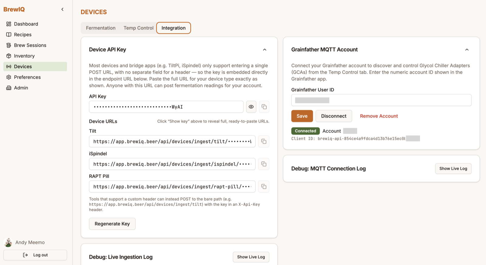
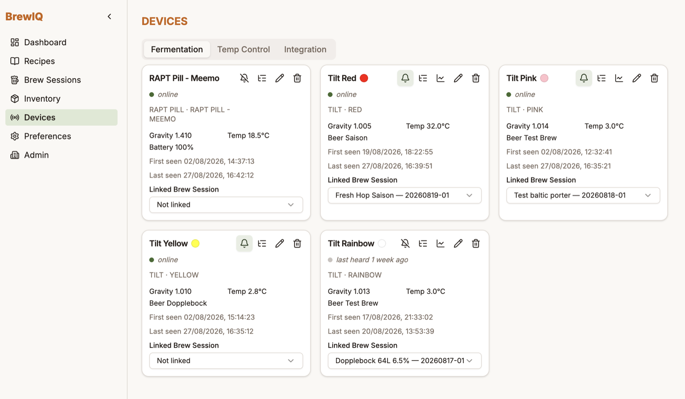
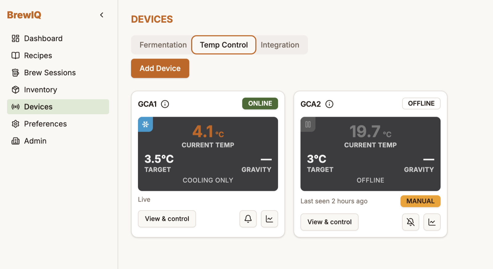
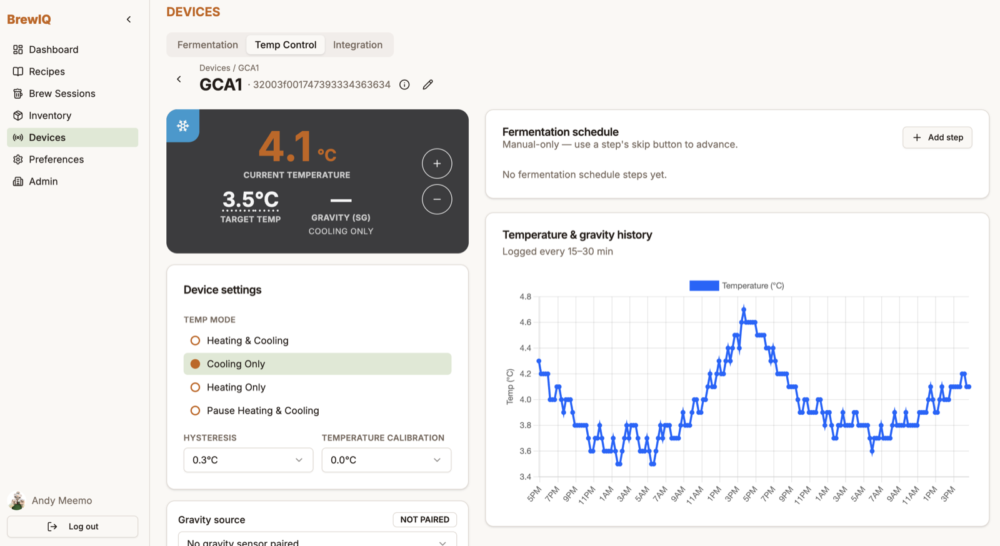

# Devices

The **Devices** page has three tabs: **Fermentation**, **Temp Control**, and **Integration**. What you see depends on your permissions.

Two important framing points before you connect anything:

- BrewIQ does **not** talk Bluetooth or discover hardware on your local network. Fermentation sensors (Tilt, iSpindel, RAPT Pill) connect by having your own bridge/app POST readings to a BrewIQ URL — you configure the device's *own* app to point at BrewIQ, not the other way around.
- Grainfather is the only temperature-controller integration. There's no generic/vendor-neutral controller support (e.g. Inkbird).

## Integration tab — set this up first

### Device API Key (for Tilt / iSpindel / RAPT Pill)



Click **Generate Key** to create your device API key. This gives you a set of copyable **Device URLs**, one per device type:

```
{your BrewIQ URL}/api/devices/ingest/tilt/{key}
{your BrewIQ URL}/api/devices/ingest/ispindel/{key}
{your BrewIQ URL}/api/devices/ingest/rapt/{key}
```

Copy the URL for your device type and paste it into that device's own app/bridge wherever it asks for a logging or webhook URL:

- **Tilt** — use the Tilt app's "Custom function"/custom logging URL field (the same mechanism apps like Brewer's Friend use), or a Bluetooth relay such as TiltPi configured the same way.
- **iSpindel** — its HTTP upload configuration.
- **RAPT Pill** — its cloud webhook configuration.

The key is embedded in the URL itself, because most of these devices/bridges only support a single URL field with no separate header field. If your tool *does* support a custom header, you can instead POST to the bare `/api/devices/ingest/{type}` path with the key in an `X-Api-Key` header.

Anyone with one of these URLs can post readings to your account, so treat them like a password. Click the eye icon to reveal the full key when you need to copy it. If a key ever leaks, click **Regenerate Key** (you'll need to re-confirm your password, and every device's URL changes immediately).

There's no "add a Tilt" step beyond this — a Tilt (or iSpindel/RAPT Pill) shows up automatically on the **Fermentation** tab the first time it successfully posts a reading.

### Grainfather MQTT Account

To use Grainfather temperature control, connect your Grainfather account first:

1. Open the **Grainfather User ID** field and enter the numeric account ID shown in the Grainfather app.
2. Click **Save**.
3. Once connected, the panel shows a status badge — **Connected**, **Disconnected**, or **Paused** — and buttons to **Connect**/**Disconnect** the link or **Remove Account** entirely.

This connects your *account*, not an individual device — you still need to register each device (below).

There are also two collapsible **debug panels** on this tab — a **Live Ingestion Log** and a **MQTT Connection Log** — useful when you're setting up hardware for the first time and want to confirm readings are actually arriving. They only show the most recent activity; they aren't a permanent history.

## Fermentation tab



Every gravity/temperature sensor (Tilt, iSpindel, RAPT Pill) shows up here as a card once it's reported at least one reading. Each card shows:

- Name — Tilt devices also show a colour swatch matching the physical Tilt's colour
- Online/offline status (a device is considered online if it's reported within the last 30 minutes)
- Device type and ID (e.g. "Tilt · Red")
- Current gravity and temperature
- For Tilt: the "Beer" name set in the Tilt app (Tilt has no battery sensor, so this fills that slot). For iSpindel/RAPT Pill: battery %
- First seen / last seen timestamps
- A **Linked Brew Session** selector

Icon buttons per card let you: toggle email alerts (bell), view the raw reading history (list), view a fermentation graph if it's linked to a session with readings (line chart), rename the device (pencil), or delete it (trash). Deleting keeps the reading history by default — there's a separate "also permanently delete history" option if you want it fully gone.

### Linking a device to a brew session

Use the **Linked Brew Session** dropdown on the device card to attach it to an active session (anything not yet packaged). Once linked, every gravity reading that comes in is logged against that session and can automatically kick off fermentation tracking on it — see [Brew Sessions](brew-sessions.md).

## Temp Control tab (Grainfather)

### Adding a device

Click **Add Device** and fill in:

- **Serial (esp_chip_id)** — copy this exactly from the Grainfather app
- **Friendly name** — whatever you want to call it (e.g. "GCA1")
- **Type** — **Temp Controller** (a Glycol Chiller Adapter) or **Brew Unit** (a G70). Note: Brew Unit devices are tracked for identification only — BrewIQ doesn't send them commands.

There's no auto-discovery here — you have to register the serial manually.

### Monitoring and control



Each Temp Control card shows current temp, target temp, a linked gravity reading (if you've paired one), and a status icon for heating/cooling/paused/idle. Click **View & control** to open the full device detail view, where you can:

- Click the target temperature to open **Set Target Temperature** and change it
- Use the +/- buttons for quick nudges (changes commit to the device after a short delay)
- Set **Temp Mode**: Heating & Cooling, Cooling Only, Heating Only, or Pause Heating & Cooling
- Adjust **Hysteresis** and **Temperature Calibration**
- Pick a **Gravity source** — link a Fermentation-tab device so its gravity reading shows alongside temperature
- Set a **Linked Brew Session**
- View a **Temperature & gravity history** chart (logged roughly every 15–30 minutes)

If a Grainfather-app brew session is actively controlling the device, BrewIQ shows controls as read-only until that session ends. If you've manually overridden the schedule, a **Resume schedule** button clears the override.



### Fermentation schedule

This is a BrewIQ-side schedule, not something synced to the device's own onboard programming. You add steps (label, target temp, duration, optional note), and advance through them yourself with a **Skip to {step}** button — clicking it pushes that step's target temperature to the device immediately. It's a manual aid for following a plan, not an automated timer.

## Notifications

The bell icon on a device card subscribes you to an email when that device goes **online or offline** — there's no gravity-stall or temperature-out-of-range alert. Enable/disable this default behavior per device type in [Account & Preferences](account-preferences.md).
