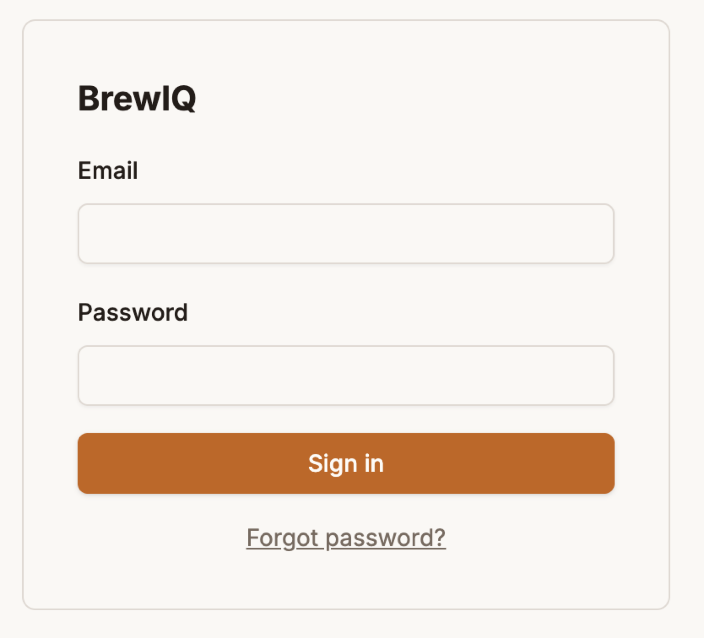
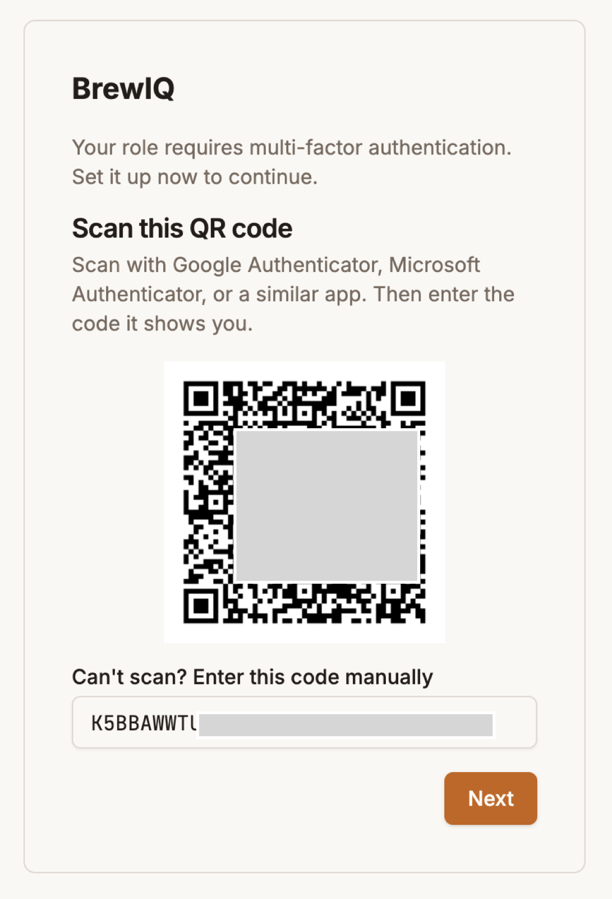
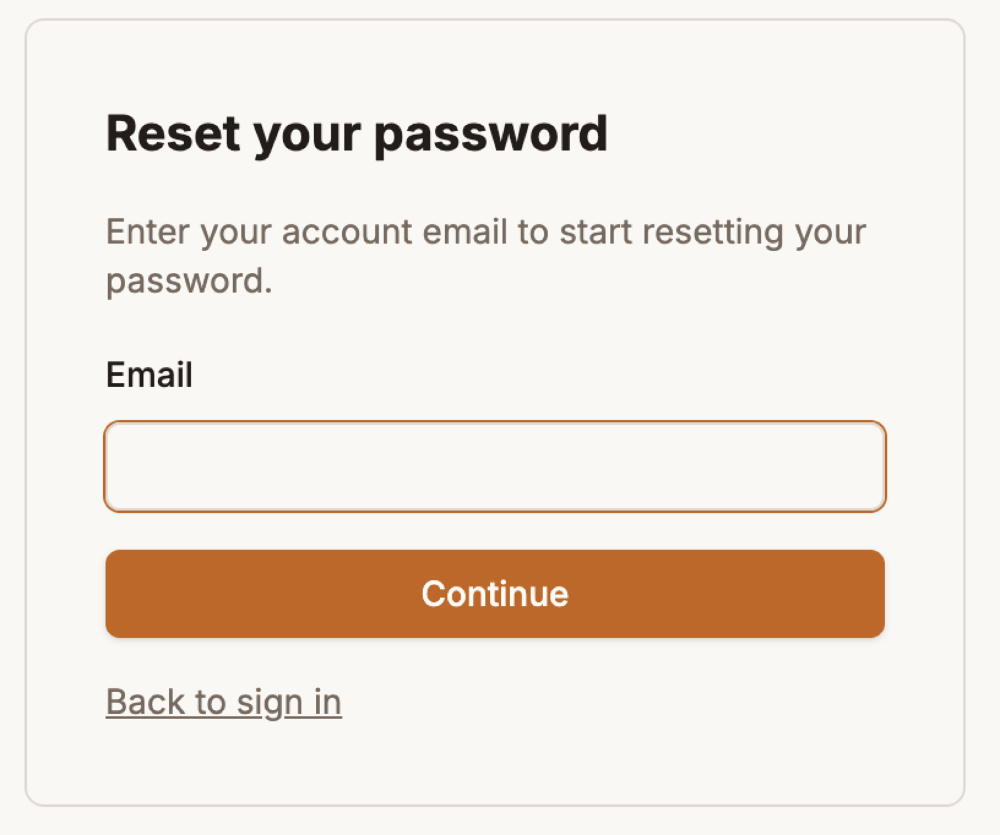

# Getting Started

## Getting an account

BrewIQ is **invite-only** — there's no public sign-up page. Your brewery admin creates your account from Tenant Admin → Users (see [Tenant Administration](tenant-administration.md)), and you'll get an email invitation with a link that's valid for **72 hours**.

Click the link and you'll be asked to:

1. Set a password (entered twice, to confirm)
2. Click **Activate account**

You'll then be signed in automatically and — depending on your role — walked straight into setting up two-factor authentication (see below).

If your invite link has expired, ask your admin to resend it from the Users tab.

## Signing in

Go to the login page and enter your **Email** and **Password**, then **Sign in**. There's no "remember me" option — sessions time out after a period of inactivity set by your admin.

If your account has two-factor authentication enabled, you'll be prompted for a second step after your password: a 6-digit code from your authenticator app, or **Use a backup code instead** if you don't have your app handy.

Forgotten your password? Click **Forgot password?** on the login screen — see below.

## Two-factor authentication (MFA)

MFA is optional by default, but some roles require it — if yours does, you'll be walked into setup automatically the first time you sign in and can't skip it.

**Setting it up:**

1. Scan the QR code with an authenticator app (Google Authenticator, Microsoft Authenticator, or similar). Can't scan? There's a manual entry code shown alongside it.
2. Enter the 6-digit code your app is now showing, and click **Activate**.
3. You'll be shown a set of **backup codes** — save these somewhere safe. Each one can be used once to sign in if you lose access to your authenticator app, and they're only shown this one time.

You can manage MFA any time from [Account & Preferences](account-preferences.md) — enable it if it's optional, **Reregister MFA** if you're moving to a new device, or **Disable MFA** (both require your password and a current code to confirm).

## Forgotten password

Click **Forgot password?** and enter your email. What happens next depends on whether MFA is already set up on your account:

- **MFA enabled** — enter a code from your authenticator app, and BrewIQ emails you a reset link (valid for 1 hour). Follow it to set a new password.
- **MFA not enabled** — self-service reset isn't available; you'll need to ask your admin to reset your password for you.

This is why it's worth setting up MFA early — it's what makes self-service password recovery possible.

## Signed in with a temporary password

If an admin created your account with a temporary password, or reset your password for you, you'll be required to set a new one the first time you sign in before you can do anything else in the app.

## Changing your email

If you change your email address yourself (from Account & Preferences), the change doesn't take effect immediately — BrewIQ sends a confirmation link to the *new* address, and you keep signing in with your old email until you click it.
