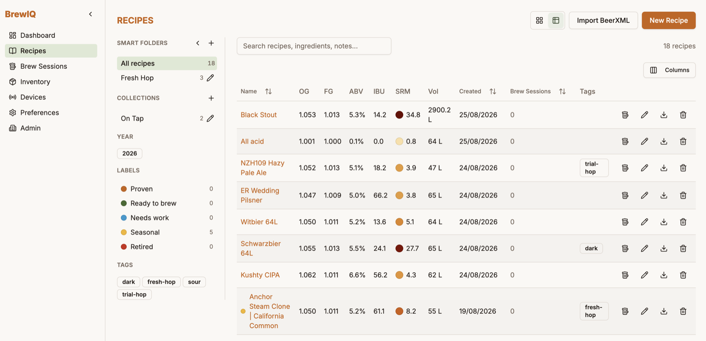
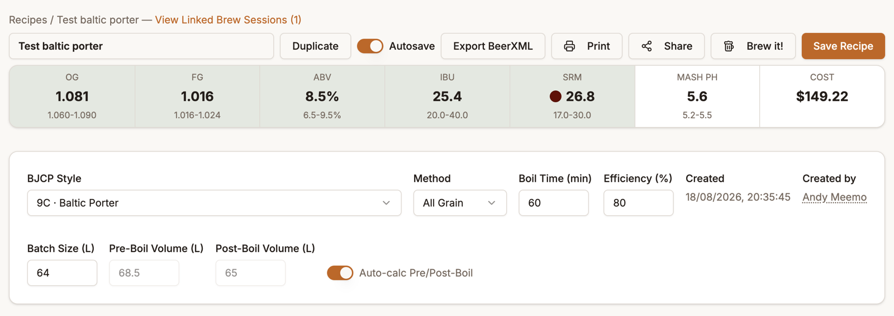
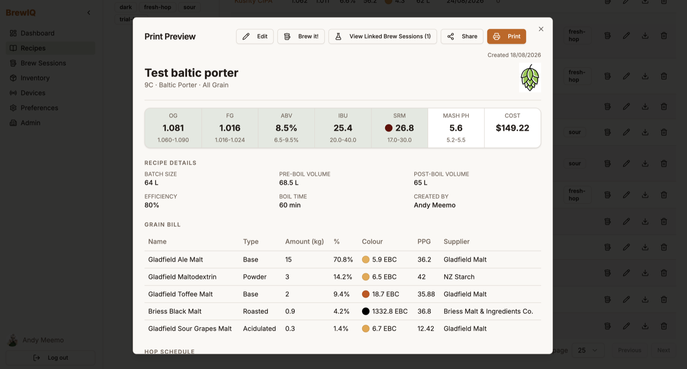

# Recipes

## The Recipes list

Switch between **Card view** and **Table view** with the toggle in the top-right. The table view shows OG, FG, ABV, IBU, SRM, batch volume, created date, and a **Brew Sessions** count you can click to jump straight to the sessions brewed from that recipe.

Search matches recipe name, notes, and any ingredient name — try `Search recipes, ingredients, notes...` for things like "citra" to find every recipe using a particular hop.

### Organizing recipes

The left rail gives you four ways to organize a growing recipe list:

- **Smart folders** — rule-based, auto-updating. Build rules against ABV, IBU, SRM, brew session count, created year, or tag (e.g. "ABV at least 6" AND "Tag is hazy"), and any recipe matching the rules appears automatically — including ones you add later.
- **Collections** — a static, hand-picked list of recipes (no rules), good for things like "Summer 2026 lineup."
- **Labels** — five fixed status tags: **Proven, Ready to brew, Needs work, Seasonal, Retired**. A recipe can carry more than one at a time, shown as colored dots. (A brewery admin can rename these slots in Tenant Admin.)
- **Tags** — free-text, tenant-wide tags you create yourself.

To label or tag a recipe, **right-click** it (in either table or card view) to open the organize menu — click a label to toggle it, or type into "Add tag..." and press Enter. Changes save instantly.

Filters (folder, year, label, tag) show as removable chips above the list; use **Clear all** to reset.

### Importing and exporting

**Import BeerXML** (top of the list page) accepts up to 5 `.xml` files at once, shows you a preview of what it found per file, and lets you deselect anything you don't want before committing. Rows with errors are shown dimmed and excluded automatically.

Each recipe row also has an **Export** (download) icon that downloads it as a standalone BeerXML file — handy for backups or moving a recipe to another tool.

## Building a recipe

Click **New Recipe**, or click a recipe name to reopen the builder on an existing one.

### Recipe Details

At the top: **BJCP Style** (searchable dropdown of the full BJCP 2021 style list), **Method** (All Grain / Extract / BIAB / Partial Mash), **Boil Time**, **Efficiency %** (your brewhouse efficiency — feeds the OG calculation directly), and **Batch Size** / **Pre-Boil Volume** / **Post-Boil Volume**.

Turn on **Auto-calc Pre/Post-Boil** and BrewIQ will keep those two volumes in sync automatically as you change batch size, boil time, or the hop schedule — turn it off if you'd rather set them manually.

### The stat strip

Right under the details, a live strip shows **OG, FG, ABV, IBU, SRM, Mash pH, and Cost**, recalculating as you edit. Once you've picked a BJCP style, each cell also shows that style's target range underneath and highlights green when you're inside it — a quick way to see if your recipe is on-style.

Treat **Mash pH** and **Cost** as directional estimates rather than lab-precision numbers — mash pH is a rule-of-thumb calculation, not a substitute for an actual meter reading.

### Grain Bill, Hop Schedule, Adjuncts, Yeast & Fermentation, Mash & Water, Notes

These are tabs (or view them all stacked at once under the **All** tab):

- **Grain Bill** — click **Add grain** to pull from your [Inventory](inventory.md) (there are separate Grains and Fermentables catalogs, both searchable/tag-filterable from the same dialog). Set the amount per grain; percentage of the grist, colour, and PPG are calculated or pulled in automatically. A running **Total grain bill** shows at the bottom.
- **Hop Schedule** — click **Add hop**, then set **Usage** (Boil / First Wort / Whirlpool / Mash / Dry Hop), **Form** (Pellet / Leaf / Fresh), **Time**, and **Amount** per addition. Picking Boil or First Wort auto-fills the time to your boil length. A summary at the bottom breaks total hops down by stage (Mash / Boil / Whirlpool / Fermenter) with a density figure so you can sanity-check dry-hop rates.
- **Adjuncts** — same add/search flow as grains and hops, with a Usage field (Mash, Sparge, Water correction, Boil, Whirlpool, Fermenter, Other).
- **Yeast & Fermentation** — pick a **Strain** from inventory and BrewIQ fills in supplier, flocculation, temperature range, expected attenuation, and fermentation temp from the strain's data (all still editable). Set **Quantity** and whether a **Starter** was used. Expected attenuation is what drives your FG estimate.
- **Mash & Water** — set your **Mash Thickness** and BrewIQ suggests a **Recommended Mash In** volume (and a **Recommended Sparge** volume, accounting for grain absorption); click **Add to schedule** on either to drop a pre-filled step into the **Mash Steps** table below, which you can then edit freely or build entirely by hand with **Add step**.
- **Notes** — a plain text field for anything else (process notes, tasting notes, etc.).

Any ingredient you add here comes straight from your ingredient catalog — if something's missing, add it in [Inventory](inventory.md) first.

### Saving

**Save Recipe** commits your changes immediately. **Autosave** (on by default, toggle in the header) saves every 60 seconds while you have unsaved changes — there's no on-screen warning if an autosave fails, so if you're making a big change, it's worth hitting Save manually before navigating away.

There's no version history — Save simply overwrites the recipe. If you want to branch off a variant without touching the original, use **Duplicate** in the header to create an independent copy first.

### Brewing from a recipe

Click **Brew it!** (in the builder header, the list row actions, or the print preview) to start a new [brew session](brew-sessions.md) from that recipe.

### Print Preview

**Print** opens a clean, printable one-page view of the recipe — details, stat strip, and every ingredient section — with **Edit**, **Brew it!**, **Share**, and a link to any linked brew sessions right in the dialog header.

## Sharing a recipe

Click **Share** (in the builder, the print preview, or a recipe's row) to open **Share Recipe**. Choose a duration (hours or days, up to 60 days) or check **Share Permanently**, then **Create Share Link**. You get:

- A public link (`.../share/{token}`) with a **Copy Link** button
- A QR code — click it to copy the image to your clipboard (it downloads as a PNG instead if your browser/connection doesn't support clipboard images)

A recipe only has **one active share link at a time** — creating a new one replaces the old, and **Stop Sharing** revokes it immediately. Anyone with the link can view a read-only version of the recipe with no login required — cost and pricing information is left out of the public view.

If a link is revoked or expired, visitors see: *"This link has expired or is no longer available."*
