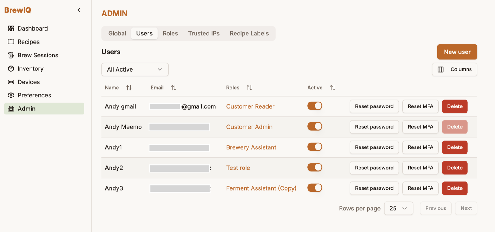
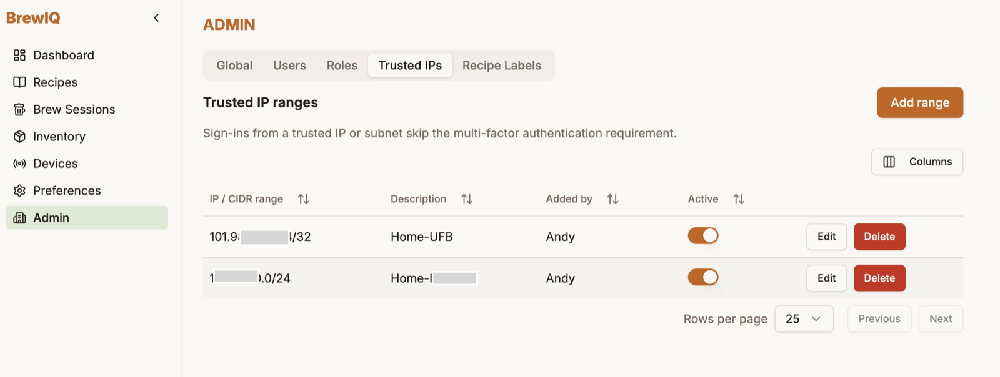

# Tenant Administration

If your role has admin permissions, an **Admin** section in the nav gives you tools to manage your brewery's BrewIQ account. Which tabs you see depends on your specific permissions.

## Users

This is where accounts get created — see [Getting Started](getting-started.md) for what a new user experiences.

Click **New user** and fill in their email, display name, and role. By default BrewIQ sends them an activation email (link valid 72 hours) to set their own password and register MFA. If you're a platform-level admin, you can instead choose **Generate a temporary password instead** to skip the email and hand them a one-time password directly — they'll be forced to change it on first login.

Per-user actions from the Users table:

- Toggle **Active/Inactive**
- Assign or remove **roles**
- **Resend activation** for anyone still pending
- **Reset password** — generates a new temporary password for them (same one-time reveal as account creation)
- **Reset MFA** — clears their enrollment; they'll be asked to set it up again next sign-in
- **Delete** (not available for your own account)

## Roles

Two tables: built-in **role templates** you can duplicate to start from, and your brewery's **custom roles**, which you create, edit, and delete freely. Editing a role opens a permission checklist — this is what controls what each role can see and do throughout BrewIQ (which Inventory tabs show up, whether they can manage devices, view fermentation data, edit recipes, and so on).

## Trusted IPs

Sign-ins from a trusted IP or subnet skip the MFA requirement. Add a CIDR range with a description to exempt it; removing one means sign-ins from that range require MFA again (if your role otherwise requires it).

## Recipe Labels

Rename the 5 fixed colour-coded recipe labels (Proven, Ready to brew, Needs work, Seasonal, Retired, by default) to whatever fits your workflow. Existing recipes keep their label assignment — only the display name changes.

## Global settings

- **Session Timeout** — how many hours of inactivity before a session expires, for everyone on your account
- **Branding** — upload your brewery's logo (PNG/JPEG, up to 1MB) to appear on printed and shared recipes in place of the BrewIQ wordmark
